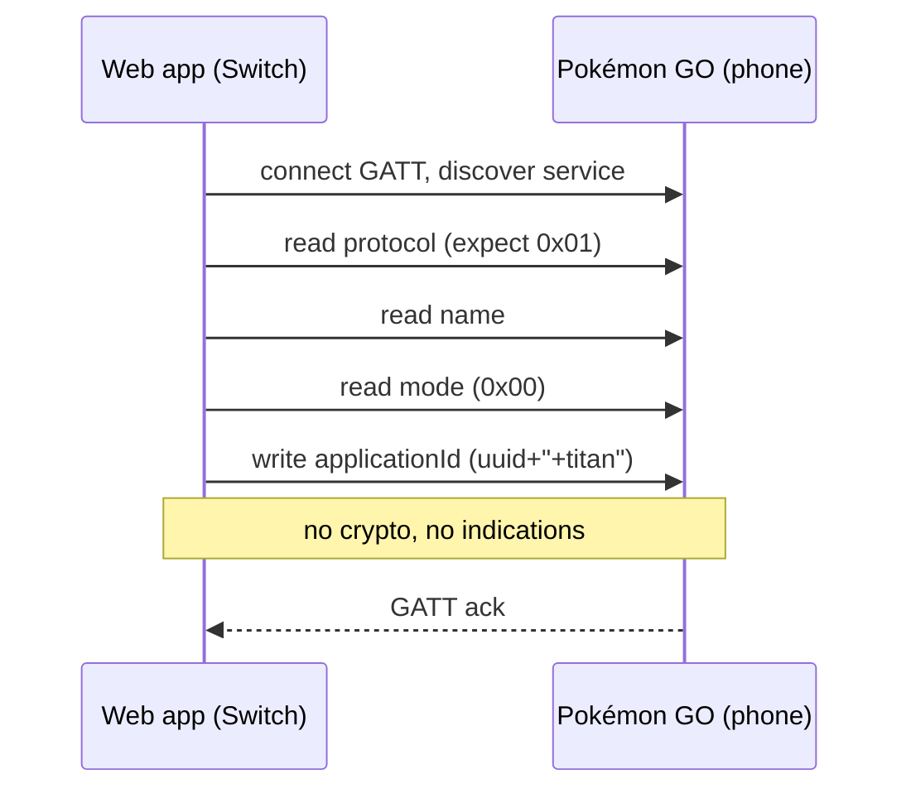
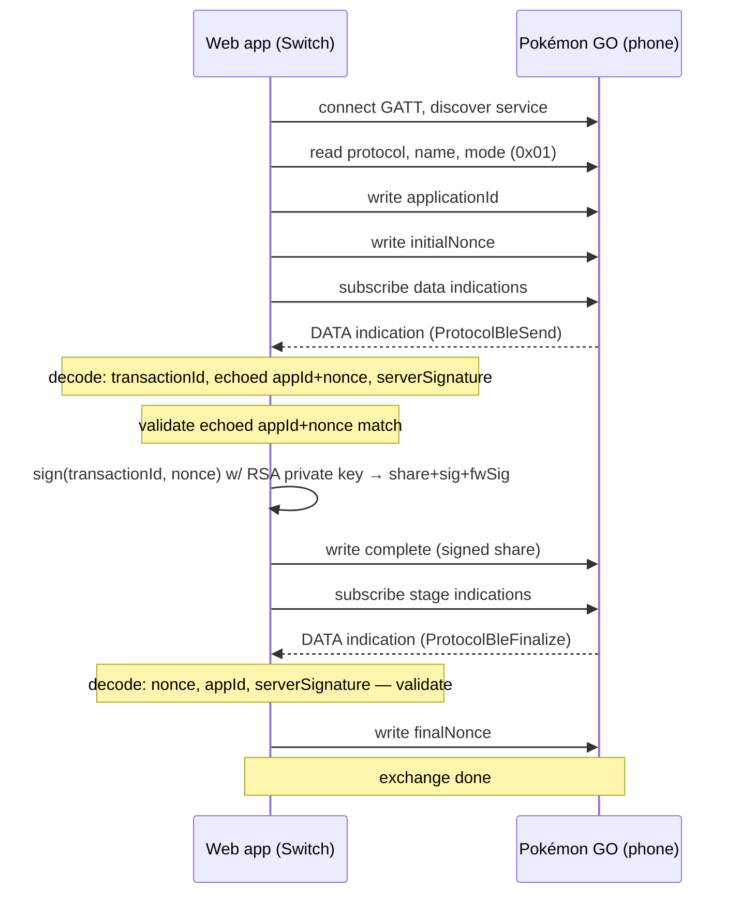

# Protocol

Web app emulate Nintendo Switch. Talk to Pokémon GO app over Web Bluetooth GATT to do postcard exchange. Ref: https://scarletviolet.pokemon.com/en-gb/news/pokemon_go_connect/

Two separate connects needed. Mode byte on device pick which.

## Roles

- **Central**: browser (this app). Scans + connects.
- **Peripheral**: phone running Pokémon GO. Advertises service, holds GATT server.

## GATT map

Service `abfaf4c7-5a44-445a-a007-ad19fcb29e99` (advertised as `b6c3089a-7e4f-487d-b9f8-73a281dd718f`)

| name | uuid | op | purpose |
|---|---|---|---|
| protocol | `291e0889-...` | read | must equal `0x01` |
| name | `95c33c9a-...` | read | player name, 4–15 UTF-8 bytes |
| mode | `8f860fd8-...` | read | `0x00`=pair, `0x01`=exchange |
| applicationId | `28fdc6ec-...` | write w/ response | 69-byte fixed field |
| initialNonce | `2f8b06c2-...` | write w/o response | nonce + NUL |
| complete | `c5b318da-...` | write w/o response | signed share |
| finalNonce | `6324802e-...` | write w/ response | closes exchange |
| data | `000dd3aa-...` | indicate | server response (exchange) |
| stage | `e35da264-...` | indicate | server finalize (exchange) |

## Connection 1 — Pair fake Switch (mode `0x00`)



Ambiguous ack case: some ATT writes fail on browser side (`NotSupportedError`/`NetworkError`/`OperationError` w/ "gatt error unknown") even though phone got it. App does NOT retry (`app.js` `writeRegistrationApplicationId`) — retry risk double-register.

## Connection 2 — Postcard exchange (mode `0x01`)

Player starts sending postcard in-game first, then reconnects web app.



## Wire format

Custom minimal protobuf (varint + length-delimited only, hand-rolled encode/decode in `protocol.js`).

**ProtocolBleSend** (received, field 1 = outer):
```
1: bytes -> prep {
     1: varint  data
     2: varint  transactionId
     3: bytes   applicationId (utf-8)
     4: bytes   nonce (utf-8)
   }
2: bytes  serverSignature
```

**ProtocolShare** (sent inside `complete`, before signing):
```
1: varint transactionId
2: bytes  nonce (utf-8)
```

**ProtocolComplete** (written to `complete` char):
```
1: bytes share            (= ProtocolShare above)
2: bytes applicationSignature  (256-byte RSA sig over share)
3: bytes firmwareSignature     (first 16 bytes of applicationSignature)
```

**ProtocolBleFinalize** (received on stage indication):
```
1: bytes -> complete {
     1: bytes nonce
     2: bytes applicationId
   }
2: bytes serverSignature
```

## Crypto

- Peripheral (fake Switch) signs `share` bytes: SHA-256 digest → manual PKCS#1 v1.5 pad (`00 01 FFFF..00 <DigestInfo prefix> <digest>`) → `modPow(msg, privExp, mod)`.
- Key: 2048-bit RSA, private exponent + modulus hardcoded in `protocol.js` (base64 JSON blob, `atob`+`JSON.parse`, no encryption — just avoids grep). This is the extracted Switch accessory private key, lets browser forge a real device's signature.
- Nonce: random 64-bit tick → FNV-1a 64-bit hash → hex string (`peripheralNonceFromTick`).
- Mutual auth: both sides echo `applicationId`+`nonce` back; each side validates echo before trusting message (`validateSend`, `validateFinalize`). No signature verification of server side happens client-side (`serverSignature` decoded but unused) — trust is one-directional (phone trusts Switch's signature; Switch doesn't check phone's).

## applicationId format

`<uuidv4>+titan`, padded to fixed 69-byte GATT field (`APPLICATION_ID_GATT_WIDTH`), zero-padded tail.
