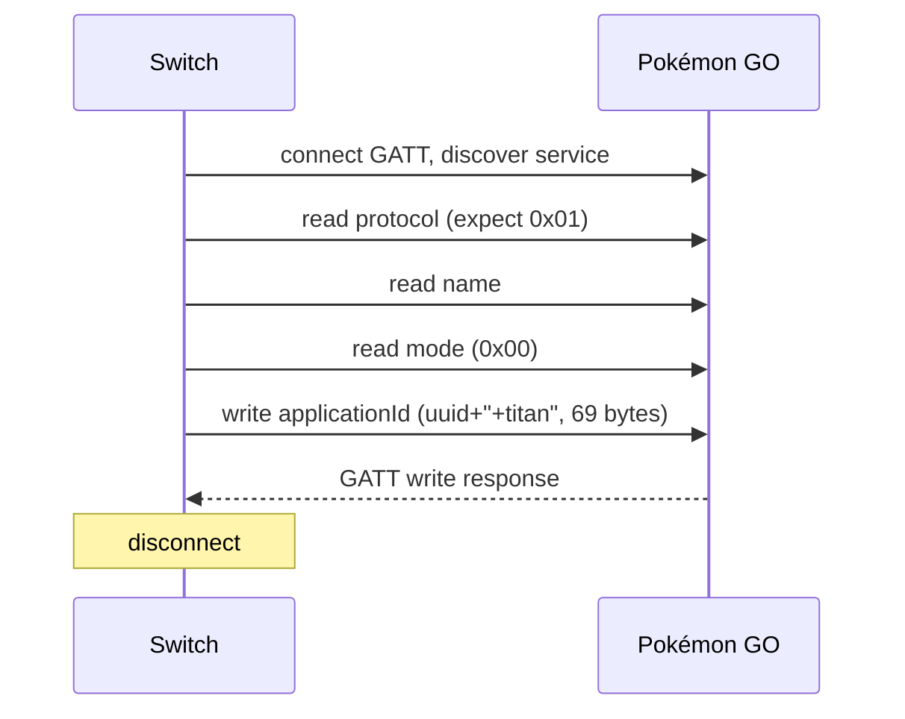
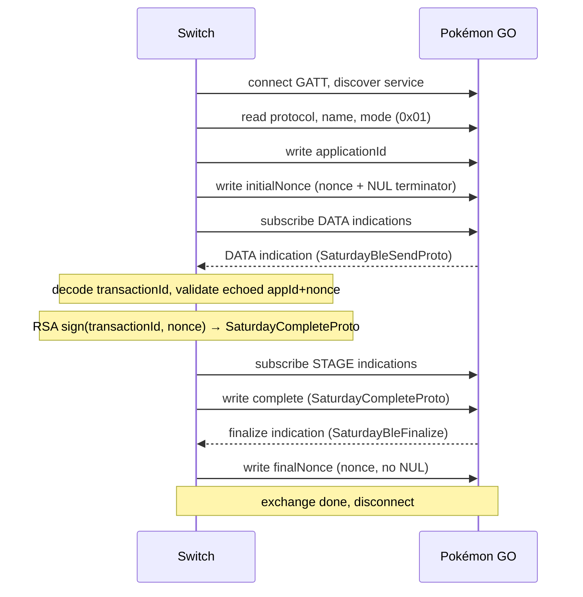

# Protocol

Web app emulates Nintendo Switch. Talks to Pokémon GO app over Bluetooth LE GATT to do postcard exchange. Ref: https://scarletviolet.pokemon.com/en-gb/news/pokemon_go_connect/

Two separate connections needed. Mode byte on device picks which.

## Roles

- **Central**: browser or Android app (emulates Switch). Scans + connects.
- **Peripheral**: phone running Pokémon GO. Advertises service, holds GATT server.

## GATT map

Service `abfaf4c7-5a44-445a-a007-ad19fcb29e99` (advertised as `b6c3089a-7e4f-487d-b9f8-73a281dd718f`)

| name | uuid | op | purpose |
|---|---|---|---|
| protocol | `291e0889-...` | read | must equal `0x01` |
| name | `95c33c9a-...` | read | player name, 4–15 UTF-8 bytes |
| mode | `8f860fd8-...` | read | `0x00`=pair, `0x01`=exchange |
| applicationId | `28fdc6ec-...` | write w/ response | 69-byte fixed field |
| initialNonce | `2f8b06c2-...` | write w/o response | nonce + NUL terminator |
| complete | `c5b318da-...` | write w/o response | signed SaturdayCompleteProto |
| finalNonce | `6324802e-...` | write w/ response | nonce bytes, no NUL. Any value accepted. |
| data | `000dd3aa-...` | indicate | SaturdayBleSendProto |
| stage | `e35da264-...` | indicate | SaturdayBleFinalize |

## Connection 1 — Pair (mode `0x00`)



Ambiguous ack case: some ATT writes fail on browser side (`NotSupportedError`/`NetworkError`/`OperationError` w/ "gatt error unknown") even though phone got it. App does NOT retry — retry risks double-register.

## Connection 2 — Postcard exchange (mode `0x01`)

Player starts sending postcard in-game first, then Switch connects.



### Finalize indication characteristic varies by platform

- **iOS GO** sends finalize on the **STAGE** characteristic.
- **Android GO** sends finalize on the **DATA** characteristic (same as the first indication).

Implementations must listen on both DATA and STAGE for the finalize indication.

### Timing

Real Switch has zero artificial delays between GATT operations during exchange. The exchange completes in 800–1200ms total. Typical intervals from BLE traces:

| step | time |
|---|---|
| write appId → write nonce | 30–60ms |
| write nonce → DATA indication | 180–380ms |
| DATA indication → write complete | 240–370ms (includes RSA signing) |
| write complete → finalize indication | 250–330ms |
| finalize indication → write finalNonce | 75–90ms |

## Protobuf messages

Internal codename: "Saturday" (Niantic side) / "Titan" (Game Freak side). Hand-rolled minimal protobuf — varint + length-delimited only.

### SaturdayBleSendPrepProto (inner message of SaturdayBleSendProto)

```
1: varint  data              // SaturdayCompositionData enum (Vivillon pattern, 0–20)
2: varint  transactionId     // int64, server-generated
3: bytes   applicationId     // echoed back (utf-8)
4: bytes   nonce             // echoed back (utf-8)
```

### SaturdayBleSendProto (received on DATA indication)

```
1: bytes   server_response   // SaturdayBleSendPrepProto
2: bytes   server_signature  // 256 bytes, server RSA signature
```

### SaturdayBleCompleteRequestProto (inner message, serialized then signed)

```
1: varint  transactionId
2: bytes   nonce (utf-8)
```

### SaturdayCompleteProto (written to `complete` characteristic)

```
1: bytes   saturday_share          // serialized SaturdayBleCompleteRequestProto
2: bytes   app_signature           // 256-byte RSA signature over saturday_share
3: bytes   firmware_signature      // first 16 bytes of app_signature
```

### SaturdayBleSendCompleteProto (inner message of SaturdayBleFinalize)

```
1: bytes   nonce             // echoed back (utf-8)
2: bytes   applicationId     // echoed back (utf-8)
```

### SaturdayBleFinalize (received on finalize indication)

```
1: bytes   saturday_send_complete  // SaturdayBleSendCompleteProto
2: bytes   server_signature        // 256 bytes
```

### SaturdayCompositionData (Vivillon pattern enum)

Values 0–20 map to Vivillon forms (Archipelago, Continental, Elegant, ..., Tundra). Values 21–63 are unused obfuscation padding.

## Crypto

### RSA signing

Switch signs the serialized `SaturdayBleCompleteRequestProto` with RSA-2048 PKCS#1 v1.5 SHA-256. Same 2048-bit RSA key is used for both `app_signature` and `firmware_signature` — the keys are identical in the Switch firmware (`SignApp` and `SignFirmware` use the same modulus and private exponent). Since RSA-PKCS1-SHA256 is deterministic, both produce the same 256-byte signature. `firmware_signature` is the first 16 bytes of that output.

Key material: private exponent + modulus hardcoded (extracted from Switch accessory firmware).

### Nonce generation

Random 64-bit value (Switch uses `nn::os::GetSystemTick()`) → FNV-1a 64-bit hash → hex string (`%" PRIx64"`). Variable length (14–16 hex chars, no zero-padding). Written with NUL terminator for `initialNonce`, without NUL for `finalNonce`.

### Validation

Both sides echo `applicationId` + `nonce` back. Each side validates the echo before trusting the message. Server signature is decoded but not verified client-side — trust is one-directional (phone trusts Switch's RSA signature; Switch doesn't verify phone's signature).

## applicationId

Format: `<uuid>+titan`, zero-padded to 69 bytes (`APPLICATION_ID_GATT_WIDTH`).

Real Switch uses `nn::oe::GetPseudoDeviceId()` — a UUIDv5 deterministic per-console (derived from device ID + application title ID). Same applicationId is used for every pairing and exchange, forever. Pokémon GO does not validate the UUID version or source — any valid UUID works.

### Paired list

The real Switch maintains a save-data list of paired Pokémon GO trainer names. During exchange (mode `0x01`), it checks the trainer name against this list and rejects unknown names. During pairing (mode `0x00`), all names are accepted and added to the list. This check is enforced Switch-side only — GO does not validate it.
